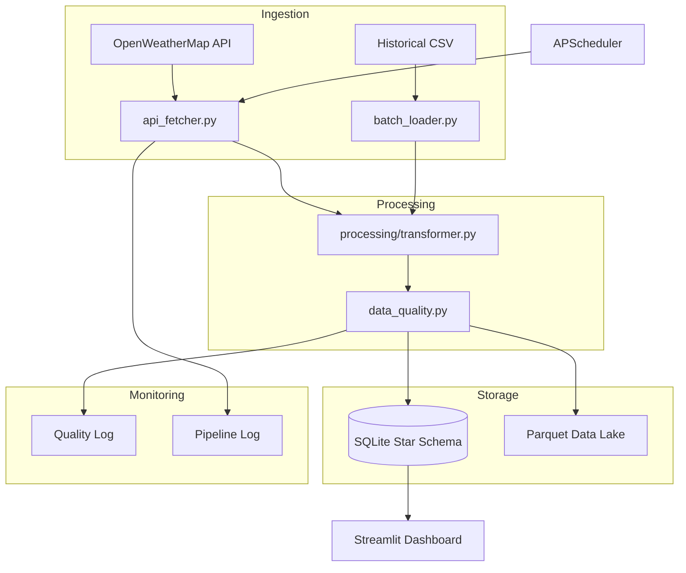

# Real-Time Weather Analytics Pipeline

> **Capstone Project** — Production-style data engineering pipeline for live weather data across Indian cities.

---

## Overview

The Real-Time Weather Analytics Pipeline ingests live weather data from OpenWeatherMap for the **Top 10 Indian Metropolitan Hubs** (Mumbai, Delhi, Bangalore, Hyderabad, Chennai, Kolkata, Pune, Ahmedabad, Jaipur, Lucknow). It cleans and enriches data with derived metrics (Heat Index, Wind Chill), persists it in a SQLite star schema and a Parquet data lake, and presents the results through a premium, warm-charcoal themed Streamlit dashboard.

---

## Architecture



---

## Tech Stack

| Tool | Purpose | Why Chosen |
|---|---|---|
| Python 3.10+ | Core language | Ecosystem breadth, readability |
| OpenWeatherMap API | Live weather source | Free tier, no credit card |
| SQLite | Star schema RDBMS | Zero-server, ships with Python |
| Parquet + PyArrow | Columnar data lake | Industry standard, great compression |
| pandas | ETL DataFrame engine | De-facto standard for data wrangling |
| APScheduler | Pipeline orchestration | Lightweight, no infra overhead |
| Streamlit ≥ 1.32 | Dashboard framework | Rapid Python-native UI |
| Matplotlib / Seaborn| Visualization | Instrument-grade static rendering |
| python-dotenv | Secret management | Keeps API key out of source code |
| SQLAlchemy | ORM utility layer | Used by pandas `to_sql` backend |

---

## Project Structure

```
weather-pipeline/
├── config.py                  # Central config & constants
├── requirements.txt
├── .env.example               # API key template
├── .gitignore
├── README.md
├── run_pipeline.py            # CLI entry point
│
├── ingestion/
│   ├── __init__.py
│   ├── api_fetcher.py         # OpenWeatherMap API client
│   └── batch_loader.py        # Historical CSV loader
│
├── processing/
│   ├── __init__.py
│   ├── transformer.py         # Enrichment (heat index, wind chill, …)
│   └── data_quality.py        # Quality checks + scoring
│
├── storage/
│   ├── __init__.py
│   ├── schema.sql             # Star schema DDL
│   └── db_writer.py           # Dimension upserts + fact inserts
│
├── scheduler/
│   ├── __init__.py
│   └── pipeline_scheduler.py  # APScheduler wrapper
│
├── dashboard/
│   ├── __init__.py
│   └── app.py                 # Streamlit 4-page dashboard
│
├── data/
│   ├── parquet/               # Timestamped Parquet exports
│   └── .gitkeep
│
├── logs/
│   └── .gitkeep               # pipeline.log written here
│
└── docs/
    └── architecture.md        # Detailed architecture notes
```

---

## Setup Instructions

1. **Clone the repository**
   ```bash
   git clone https://github.com/<your-username>/weather-pipeline.git
   cd weather-pipeline
   ```

2. **Create a virtual environment**
   ```bash
   python -m venv venv
   # Windows
   venv\Scripts\activate
   # macOS / Linux
   source venv/bin/activate
   ```

3. **Install dependencies**
   ```bash
   pip install -r requirements.txt
   ```

4. **Configure your API key**

   Copy the env template and add your free OpenWeatherMap key
   (sign up at <https://openweathermap.org/api> — free keys activate within 2 hours):
   ```bash
   cp .env.example .env
   # Open .env and replace your_api_key_here with your actual key
   ```

5. **Run the pipeline once**
   ```bash
   python run_pipeline.py --once
   ```

6. **Launch the dashboard**
   ```bash
   streamlit run dashboard/app.py
   ```
   Open <http://localhost:8501> in your browser.

---

## Usage

| Command | Description |
|---|---|
| `python run_pipeline.py --once` | Run the full ETL pipeline one time and exit |
| `python run_pipeline.py --schedule` | Start hourly scheduler loop (Ctrl+C to stop) |
| `python run_pipeline.py --load-csv path/to/file.csv` | Batch-load a historical CSV |
| `streamlit run dashboard/app.py` | Launch the dashboard |

---

## Dashboard Screenshots

### 1. Live Conditions


### 2. Historical Trends


### 3. City Comparison


---

## Data Model

The pipeline uses a **star schema** in SQLite:

- **`dim_city`** — one row per city with name, country, and GPS coordinates
- **`dim_date`** — one row per calendar date with year / month / day / weekday flags
- **`dim_condition`** — deduplicated (weather_main, weather_desc, comfort_level) tuples
- **`fact_weather`** — central fact table at hourly granularity; joins to all three dims
- **`raw_weather`** — schema-free raw API dump for auditability and re-processing
- **`quality_log`** — one audit row per pipeline run with DQ metrics and pass/fail gate
- **`pipeline_log`** — execution log: start/end time, row counts, status, error message

---

## Key Features

- 🌐 **Live ingestion** — real-time weather data for the top 10 Indian metros
- 🏗️ **Warm Aesthetic** — premium charcoal and amber design with Outfit & JetBrains Mono typography
- ❄️ **Meteorological enrichment** — Steadman heat index, Environment Canada wind chill
- 🏗️ **Star schema** — production-style dimensional model in SQLite
- 🗄️ **Parquet data lake** — timestamped columnar exports for analytical queries
- ✅ **Data quality gates** — automated scoring with pass/fail thresholds
- 📊 **Dynamic Charts** — instrument-grade Matplotlib visualizations with smart marker rendering
- 🔒 **Secure config** — API keys loaded from `.env`, never hard-coded

---

## Future Improvements

- ☁️ **Cloud deployment** — containerise with Docker and deploy to GCP Cloud Run or AWS Lambda
- 🤖 **ML forecasting** — add a Prophet or LSTM model for 24-hour temperature prediction
- 🔔 **Alert system** — send Telegram / email alerts when quality score drops below threshold
- 📡 **More cities** — extend CITIES list and parameterise via CLI flags
- 📦 **Delta Lake / Iceberg** — replace plain Parquet files with a transactional table format
